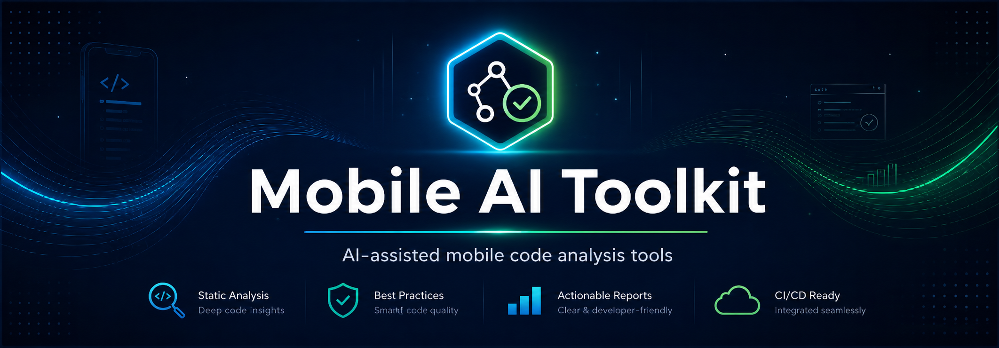

<div align="center">
  
</div>

# Mobile AI Toolkit

> **Leer en otro idioma:** [English](README.md) · **Español**

[](.github/workflows/compose-guardrails.yml)
[](LICENSE)
[](docs/roadmaps/compose-guardrails.md)
[](https://kotlinlang.org/)
[](docs/roadmaps/README.md)

Monorepo open source en Kotlin para herramientas de análisis de código mobile asistidas por IA.

`mobile-ai-toolkit` ofrece CLIs prácticas que analizan codebases mobile, detectan riesgos de arquitectura y calidad, y generan reportes Markdown accionables.

## Por qué existe este proyecto

- Los equipos mobile necesitan análisis rápidos y repetibles antes de code review o gates de CI.
- Los checks estáticos tradicionales suelen perder problemas de arquitectura y de flujo de trabajo.
- Los guardrails asistidos por IA mejoran la señal cuando prompts, esquemas y salidas se mantienen deterministas.

Este repositorio está organizado como una plataforma multi-herramienta: una base compartida más herramientas independientes en `tools/`.

## Qué hay en este repositorio

`mobile-ai-toolkit` es un ecosistema de herramientas enfocadas para equipos mobile:

| Componente | Qué hace | Dónde leer más |
| --- | --- | --- |
| `compose-guardrails` | Revisa código Jetpack Compose con guardrails de arquitectura, estado, side-effects, accesibilidad y límites MPP. | [tools/compose-guardrails/README.md](tools/compose-guardrails/README.md) |
| `kmp-project-auditor` | Audita estructura de proyectos Kotlin Multiplatform, límites de source sets y fugas entre plataformas. | [tools/kmp-project-auditor/README.md](tools/kmp-project-auditor/README.md) |
| `shared/ai-client` | Abstracción agnóstica de proveedor IA usada por las herramientas (`fake`, `openai`, `anthropic`, `gemini`). | [shared/ai-client](shared/ai-client) |
| `shared/report-common` | Esquema compartido de findings y utilidades para renderizar reportes Markdown. | [shared/report-common](shared/report-common) |

## Herramientas

| Herramienta | Comando | Enfoque | Estado |
| --- | --- | --- | --- |
| `compose-guardrails` | `mobile-ai guardrails check <path>` | Guardrails de Jetpack Compose para arquitectura, estado, side-effects, accesibilidad y límites MPP | Activa |
| `kmp-project-auditor` | `kmp audit <path>` | Auditoría de estructura de proyecto Kotlin Multiplatform y límites entre plataformas | Activa |

Documentación por herramienta:
- [compose-guardrails README](tools/compose-guardrails/README.md)
- [kmp-project-auditor README](tools/kmp-project-auditor/README.md)

## Inicio rápido

Ejecuta desde la raíz del repositorio.

1. Compose guardrails (proveedor `fake` determinista):

```bash
MOBILE_AI_PROVIDER=fake ./gradlew :tools:compose-guardrails:run --args="guardrails check $PWD/tools/compose-guardrails/examples/bad-compose-sample --rule-set default --output $PWD/artifacts/compose-guardrails-report.md"
```

2. Auditoría KMP:

```bash
MOBILE_AI_PROVIDER=fake ./gradlew :tools:kmp-project-auditor:run --args="kmp audit $PWD/tools/kmp-project-auditor/examples/bad-kmp-library --output $PWD/artifacts/kmp-project-auditor-report.md"
```

3. Ejecutar tests principales:

```bash
./gradlew :shared:ai-client:test :shared:report-common:test :tools:compose-guardrails:test :tools:kmp-project-auditor:test
```

## Estado actual

| Área | Estado |
| --- | --- |
| CLI `compose-guardrails` | Baseline estable |
| CLI `kmp-project-auditor` | Baseline estable |
| Capa compartida de proveedores IA | Baseline estable |
| Reportes Markdown | Baseline estable |
| Análisis AST/compiler-level | Planificado |
| Paridad SARIF/JSON entre herramientas | Planificado |

## Configuración en runtime

La configuración del proveedor en runtime es compartida entre herramientas:

- `MOBILE_AI_PROVIDER` (`fake`, `openai`, `anthropic`, `gemini`)
- `MOBILE_AI_API_KEY` (requerida para proveedores reales)
- `MOBILE_AI_MODEL` (requerido para proveedores reales)

Para ejecuciones deterministas en local/CI, usa `MOBILE_AI_PROVIDER=fake`.

Seguridad:
- Nunca subas API keys o tokens al repositorio.
- Guarda secretos en variables de entorno o secrets de CI.

## CI y GitHub Action

Workflow base actual:
- [.github/workflows/compose-guardrails.yml](.github/workflows/compose-guardrails.yml)

Comportamiento actual por defecto (orientado a reporte):
- Ejecuta tests.
- Ejecuta `compose-guardrails`.
- Sube artefacto del reporte Markdown.
- Mantiene `fail-on-findings` como opción opt-in.

Action reutilizable para repos externos:
- [.github/actions/compose-guardrails/action.yml](.github/actions/compose-guardrails/action.yml)

Uso mínimo:

```yaml
- id: compose-guardrails
  uses: your-org/mobile-ai-toolkit/.github/actions/compose-guardrails@v0.1.2
  with:
    target: .
    provider: fake
    rule-set: default
    report-path: artifacts/compose-guardrails-report.md
```

Para opciones completas (`changed-files-only`, `fail-on-findings`, comportamiento del step summary), ver:
- [tools/compose-guardrails/README.md](tools/compose-guardrails/README.md)

## Cómo funciona

1. Elige una herramienta y path objetivo (UI en Compose o raíz de proyecto KMP).
2. El scanner recopila evidencia local determinista desde archivos fuente.
3. Los prompts se ensamblan desde archivos Markdown versionados con reglas.
4. El proveedor IA seleccionado revisa únicamente la evidencia recopilada.
5. Los findings se parsean a un esquema estricto y se renderizan como reportes Markdown.

Este diseño mantiene el comportamiento determinista cuando es posible y aísla la lógica específica de proveedores detrás de interfaces.

## Arquitectura

- Los módulos CLI manejan parseo de argumentos, orquestación y salida.
- La lógica core de cada herramienta vive en `tools/<tool-name>/`.
- Las abstracciones compartidas viven en `shared/`.
- Los proveedores de IA están detrás de interfaces (`AiClient`), nunca acoplados a la lógica de dominio.
- Los prompts son archivos Markdown, no strings hardcodeados en Kotlin.

Leer:
- [Architecture guide](docs/architecture.md)

## Estructura del repositorio

- `tools/`: CLIs y lógica de análisis específica de cada herramienta.
- `shared/`: módulos reutilizables de cliente IA y reporting.
- `docs/`: arquitectura, checklists y roadmaps.
- `artifacts/`: reportes de ejemplo generados.

## Roadmaps y documentación del proyecto

- [Compose Guardrails Roadmap](docs/roadmaps/compose-guardrails.md)
- [KMP Project Auditor Roadmap](docs/roadmaps/kmp-project-auditor.md)
- [Roadmaps Index](docs/roadmaps/README.md)
- [Release Checklist](docs/release-checklist.md)
- [Changelog](CHANGELOG.md)
- [Contributing](CONTRIBUTING.md)
- [Security](SECURITY.md)

## Hoja de ruta

1. Mejorar precisión de análisis (mover checks clave de heurísticas de texto a análisis estático más robusto).
2. Expandir soporte de salidas machine-readable (SARIF/JSON) entre herramientas.
3. Profundizar integración con CI para gating de reportes y flujos de equipo.
4. Añadir nuevos analizadores mobile en `tools/` reutilizando la misma arquitectura compartida.

## Limitaciones actuales

- Gran parte de la detección sigue siendo heurística/textual (no análisis completo de AST o compilador).
- Los findings de IA pueden contener falsos positivos/falsos negativos.
- Los formatos de reporte son principalmente Markdown; SARIF/JSON aún no están completos en todas las herramientas.

## Licencia

Este proyecto está licenciado bajo MIT. Ver [LICENSE](LICENSE).
