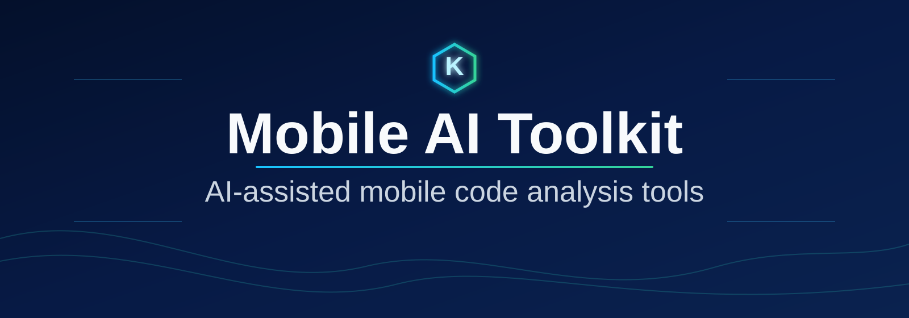

<div align="center">
  
</div>

# mobile-ai-toolkit

> **Read in another language:** **English** · [Español](README.es.md)

[](.github/workflows/compose-guardrails.yml)
[](LICENSE)
[](docs/roadmaps/compose-guardrails.md)
[](https://kotlinlang.org/)
[](docs/roadmaps/README.md)

Open-source Kotlin monorepo for AI-assisted mobile code analysis tools.

`mobile-ai-toolkit` provides practical CLIs that analyze mobile codebases, surface architecture and quality risks, and generate actionable Markdown reports.

## Why this project

- Mobile teams need fast, repeatable analysis before code review or CI gates.
- Existing static checks often miss architecture-level and workflow-level issues.
- AI-assisted guardrails can improve signal if prompts, schemas, and outputs stay deterministic.

This repository is structured as a multi-tool platform: one shared foundation plus independent tools under `tools/`.

## What is in this repository?

`mobile-ai-toolkit` is an ecosystem of focused tooling for mobile teams:

| Component | What it does | Where to read more |
| --- | --- | --- |
| `compose-guardrails` | Reviews Jetpack Compose code against architecture, state, side-effect, accessibility, and MPP boundary guardrails. | [tools/compose-guardrails/README.md](tools/compose-guardrails/README.md) |
| `kmp-project-auditor` | Audits Kotlin Multiplatform project structure, source-set boundaries, and common platform leaks. | [tools/kmp-project-auditor/README.md](tools/kmp-project-auditor/README.md) |
| `shared/ai-client` | Provider-agnostic AI client abstraction used by tools (`fake`, `openai`, `anthropic`, `gemini`). | [shared/ai-client](shared/ai-client) |
| `shared/report-common` | Shared finding schema and Markdown report rendering utilities. | [shared/report-common](shared/report-common) |

## Tooling

| Tool | Command | Focus | Status |
| --- | --- | --- | --- |
| `compose-guardrails` | `mobile-ai guardrails check <path>` | Jetpack Compose guardrails for architecture, state, side effects, accessibility, and MPP boundaries | Active |
| `kmp-project-auditor` | `kmp audit <path>` | Kotlin Multiplatform project layout and platform-boundary auditing | Active |

Tool-specific docs:
- [compose-guardrails README](tools/compose-guardrails/README.md)
- [kmp-project-auditor README](tools/kmp-project-auditor/README.md)

## Quick Start

Run from repository root.

1. Compose guardrails (deterministic fake provider):

```bash
MOBILE_AI_PROVIDER=fake ./gradlew :tools:compose-guardrails:run --args="guardrails check $PWD/tools/compose-guardrails/examples/bad-compose-sample --rule-set default --output $PWD/artifacts/compose-guardrails-report.md"
```

2. KMP project audit:

```bash
MOBILE_AI_PROVIDER=fake ./gradlew :tools:kmp-project-auditor:run --args="kmp audit $PWD/tools/kmp-project-auditor/examples/bad-kmp-library --output $PWD/artifacts/kmp-project-auditor-report.md"
```

3. Run core tests:

```bash
./gradlew :shared:ai-client:test :shared:report-common:test :tools:compose-guardrails:test :tools:kmp-project-auditor:test
```

## Current Status

| Area | Status |
| --- | --- |
| `compose-guardrails` CLI | Stable baseline |
| `kmp-project-auditor` CLI | Stable baseline |
| Shared AI provider layer | Stable baseline |
| Markdown reporting | Stable baseline |
| AST/compiler-level analysis | Planned |
| SARIF/JSON parity across tools | Planned |

## Runtime Configuration

Runtime provider configuration is shared across tools:

- `MOBILE_AI_PROVIDER` (`fake`, `openai`, `anthropic`, `gemini`)
- `MOBILE_AI_API_KEY` (required for real providers)
- `MOBILE_AI_MODEL` (required for real providers)

For deterministic local/CI runs, use `MOBILE_AI_PROVIDER=fake`.

Security:
- Never commit API keys or tokens.
- Keep secrets in environment variables or CI secrets.

## CI and GitHub Action

Current baseline workflow:
- [.github/workflows/compose-guardrails.yml](.github/workflows/compose-guardrails.yml)

Current behavior is report-first by default:
- Runs tests.
- Runs `compose-guardrails`.
- Uploads Markdown report artifact.
- Keeps fail-on-findings opt-in.

Reusable action for external repositories:
- [.github/actions/compose-guardrails/action.yml](.github/actions/compose-guardrails/action.yml)

Minimal usage:

```yaml
- id: compose-guardrails
  uses: your-org/mobile-ai-toolkit/.github/actions/compose-guardrails@v0.1.2
  with:
    target: .
    provider: fake
    rule-set: default
    report-path: artifacts/compose-guardrails-report.md
```

For complete options (`changed-files-only`, `fail-on-findings`, step summary behavior), see:
- [tools/compose-guardrails/README.md](tools/compose-guardrails/README.md)

## How It Works

1. Choose a tool and target path (`compose` UI code or KMP project root).
2. The scanner collects deterministic local evidence from source files.
3. Prompt assets are assembled from versioned Markdown rule files.
4. The selected AI provider reviews only the collected evidence.
5. Findings are parsed into a strict schema and rendered to Markdown reports.

This design keeps behavior deterministic where possible and isolates provider-specific logic behind interfaces.

## Architecture

- CLI modules handle argument parsing, orchestration, and output.
- Tool-specific core logic lives under `tools/<tool-name>/`.
- Shared abstractions live under `shared/`.
- AI providers are behind interfaces (`AiClient`), never coupled to domain logic.
- Prompt assets are Markdown files, not hardcoded Kotlin strings.

Read:
- [Architecture guide](docs/architecture.md)

## Repository Layout

- `tools/`: tool CLIs and tool-specific analysis logic.
- `shared/`: reusable AI client and report modules.
- `docs/`: architecture, checklists, and roadmap docs.
- `artifacts/`: generated sample reports.

## Roadmaps and Project Docs

- [Compose Guardrails Roadmap](docs/roadmaps/compose-guardrails.md)
- [KMP Project Auditor Roadmap](docs/roadmaps/kmp-project-auditor.md)
- [Roadmaps Index](docs/roadmaps/README.md)
- [Release Checklist](docs/release-checklist.md)
- [Changelog](CHANGELOG.md)
- [Contributing](CONTRIBUTING.md)
- [Security](SECURITY.md)

## Roadmap

1. Improve analysis precision (move key checks from text heuristics to stronger static analysis).
2. Expand machine-readable output support (SARIF/JSON) across tools.
3. Deepen CI integration patterns for report gating and team workflows.
4. Add new mobile-focused analyzers under `tools/` using the same shared architecture.

## Current Limitations

- Most detection is currently heuristic/text-based (not full AST or compiler analysis).
- AI findings can contain false positives/false negatives.
- Report formats are Markdown-first; SARIF/JSON are not fully available across tools.

## License

This project is licensed under the MIT License. See [LICENSE](LICENSE).
